<div align="center">

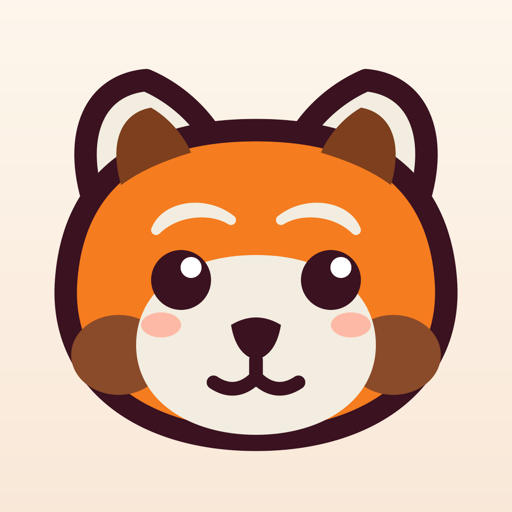

# Nivel

**Perdre du poids en douceur, sans jamais culpabiliser.**

Une app iOS gamifiée façon jeu vidéo cozy, en français, entièrement locale.

<p>
  
  
  
  
  
  
</p>

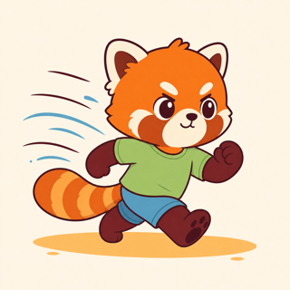

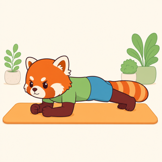
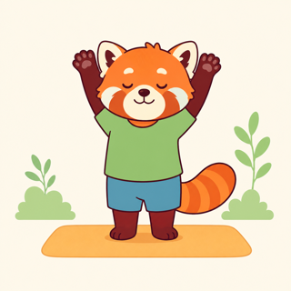
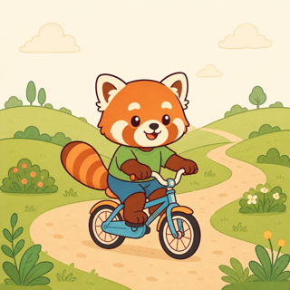
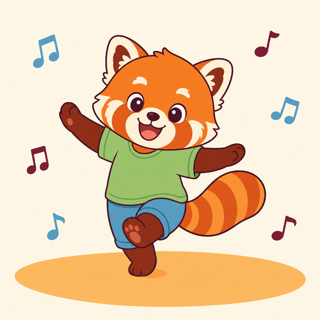

<sub>Nivelito, petit panda roux, fait chaque exercice avec toi.</sub>

</div>

---

## L'idée

On logge ses repas en quelques secondes, on suit ses pas et son poids, on valide de petites activités physiques, et on gagne de l'XP, des niveaux, des quêtes et des badges.

**Zéro pression, c'est la règle du jeu :** pas de rouge, pas de streak à ne pas casser, pas de reproche. Un jour « raté » n'existe pas. Nivelito encourage, il ne juge jamais.

## Ce qu'il y a dedans

| | |
|---|---|
| 🍲 **Repas en 3 gestes** | Catalogue de 85 aliments (plats composés, accompagnements, boissons, encas), estimation kcal immédiate, détail à l'ingrédient et au gramme si on le veut, kcal saisies à la main sinon. Objectif calculé (Mifflin-St Jeor moins 350). |
| 🏃 **Sport tout doux** | 20 activités et 11 séances composées, chacune illustrée par Nivelito, avec consignes « comment faire » et rythme suggéré. |
| ⏱️ **Séance du jour guidée** | Une étape par écran, un timer en anneau **optionnel** qu'on lance si on veut. Jamais d'avance automatique : un guide, pas un chef. |
| 🏆 **XP, niveaux, quêtes, badges** | 18 quêtes hebdo tirées le lundi, 24 badges, progression visible sans jamais de score négatif. |
| 📈 **Progrès honnêtes** | Pas quotidiens (HealthKit), tendance de poids lissée, historique. |
| 🐼 **Nivelito** | 172 messages préécrits, une phrase adaptée au moment de la journée, micro-gestes d'idle, expression contextuelle. |
| 📱 **Widgets** | Écran d'accueil et écran verrouillé, une nouvelle phrase **chaque heure**, raccourci « logger un repas » en un geste. |
| 🎨 **4 thèmes** | Crème, Menthe, Océan, Nuit douce. Réglable par téléphone. |
| 🔒 **100 % local** | Aucun compte, aucun serveur, aucun tracking. Les données ne quittent pas l'iPhone. |

Cinq onglets : **Accueil · Repas · Sport · Progrès · Quêtes**. Les réglages sont derrière le ⚙️ en haut de l'accueil.

## Captures

<div align="center">

| 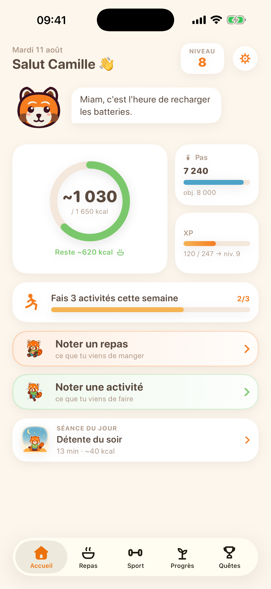 | 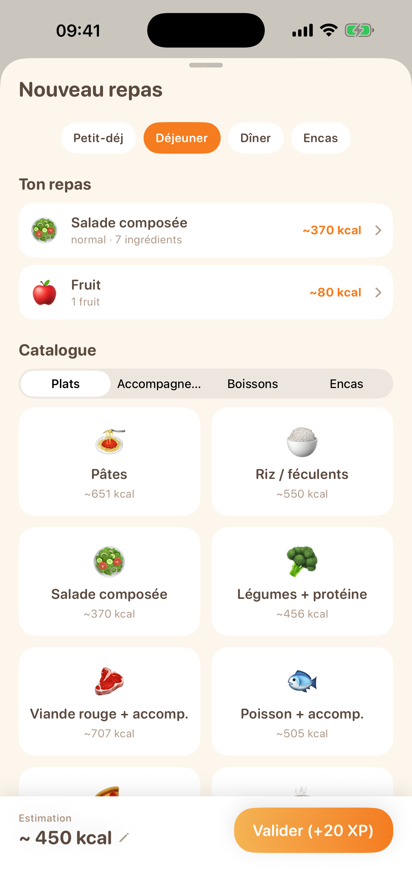 | 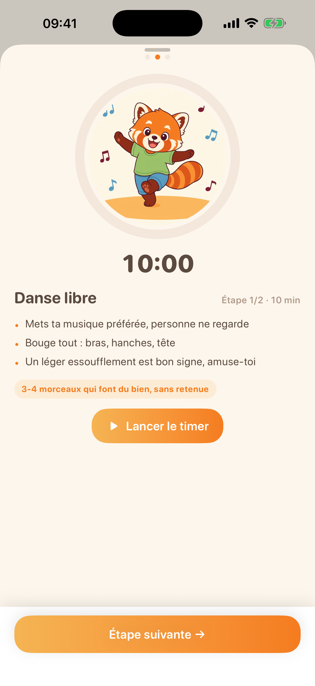 | 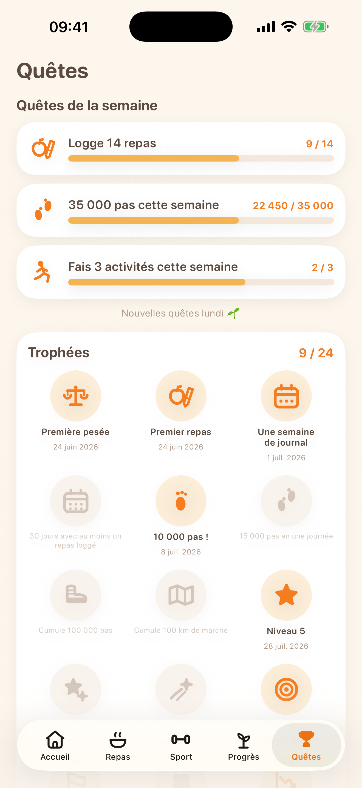 |
|:---:|:---:|:---:|:---:|
| L'accueil. | Les repas. | La séance guidée. | Quêtes et badges. |

|  |  | 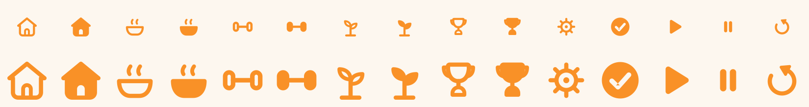 |
|:---:|:---:|:---:|
| L'icône de l'app. | L'écran de démarrage. | Les 49 icônes cozy, dessinées à la main en CoreGraphics. |

</div>

<sub>Captures reproductibles avec <code>./scripts/screenshots.sh</code> (profil de démonstration, mode DEBUG).</sub>

## Architecture

```
┌─ NivelCore/ ────────────────┐   Package Swift PUR (zéro dépendance UI, zéro SwiftData)
│  calories · XP · niveaux    │   Calculs, catalogues JSON, banque de messages,
│  quêtes · badges · tendance │   rotation de la séance du jour, planner de timeline.
│  messages · planner widget  │  166 tests, `swift test` en 0,06 s.
└─────────────┬───────────────┘
              │
    ┌─────────┴─────────┐
┌───▼──────────┐  ┌─────▼─────────┐
│ App/         │  │ Widgets/      │   Extension WidgetKit, 4 familles.
│ SwiftUI +    │  │               │
│ SwiftData    │  └─────┬─────────┘
└───┬──────────┘        │
    └────────┬──────────┘
        ┌────▼────┐
        │ Shared/ │   Compilé dans les DEUX targets : palettes, formes de
        └─────────┘   Nivelito, pont App Group (`group.com.elitedangereuse.nivel.data`).
```

- **Aucune synchronisation.** Deux installations indépendantes (un iPhone chacun), tout en local. La « séance du jour » est identique sur les deux téléphones parce qu'elle est calculée de façon déterministe à partir de la date, pas partagée par un serveur.
- **Le projet Xcode est généré** par [XcodeGen](https://github.com/yonaskolb/XcodeGen) depuis `project.yml`. Ne jamais éditer le `.xcodeproj` à la main : relancer `xcodegen generate`.

## Commandes

```sh
# Générer le projet Xcode (après clone, ou après modification de project.yml)
xcodegen generate

# Tests de la logique pure
cd NivelCore && swift test

# Tests d'intégration de l'app (SwiftData, services) sur simulateur
xcodebuild -project Nivel.xcodeproj -scheme Nivel \
  -destination 'platform=iOS Simulator,name=iPhone 17 Pro' test

# Régénérer les assets sport (App/Assets.xcassets/Sport) depuis design/sport/*.png
./scripts/import-sport-images.sh

# Régénérer les avatars de profil (App/Assets.xcassets/Avatars) depuis design/icons/{boy,girl}.png
./scripts/import-avatars.sh

# Régénérer les icônes cozy (App/Assets.xcassets/Icons + planche-contact)
swift scripts/gen-icons.swift

# Régénérer les chimes du timer (App/Resources/Sounds)
swift scripts/gen-sounds.swift
```

## Publier sur l'App Store

L'app est signée par l'association **L'Élite Dangereuse** (team `AXVF69V3LL`, bundle id
`com.elitedangereuse.Nivel`, App Group `group.com.elitedangereuse.nivel.data`). Fiche,
captures et pages web vivent dans `docs/`.

```sh
# 1. Captures d'écran 6,9" habillées (docs/appstore/framed/) — à refaire quand l'UI bouge
./scripts/screenshots.sh

# 2. Clé API App Store Connect (une fois) : rôle « App Manager », clé d'équipe
#    ~/.appstoreconnect/private_keys/AuthKey_<KEY_ID>.p8
export ASC_KEY_ID=XXXXXXXXXX
export ASC_ISSUER_ID=xxxxxxxx-xxxx-xxxx-xxxx-xxxxxxxxxxxx

# 3. Archive + IPA signée + vérifications, sans envoi
./scripts/release.sh

# 4. Idem puis envoi à App Store Connect
./scripts/release.sh --upload

# 5. Remplir la fiche : version, textes, URLs, build rattachée, captures téléversées
python3 scripts/asc-fiche.py

# 6. Aperçus vidéo : deux visites guidées filmées sur simulateur, puis téléversées
./scripts/preview.sh
python3 scripts/asc-preview.py
```

Les aperçus vidéo sont tournés par la cible **NivelUITests** (schéma `NivelPreview`, hors du
schéma `Nivel` pour ne pas ralentir les tests de tous les jours) : elle promène l'app
pendant que `simctl` filme l'écran. Deux visites plutôt qu'une, parce qu'un aperçu Apple
dure 30 s au maximum et qu'un geste XCUITest coûte ~2,5 s. Le journal du tournage nomme
chaque geste manqué, et l'encodage (`scripts/encode-preview.swift`, AVFoundation, sans
dépendance) refuse de produire une vidéo hors des contraintes d'Apple.

`asc-fiche.py` lit ses textes dans `docs/appstore/fiche-app-store.md` — un texte ne se
recopie donc jamais à deux endroits. Il ne touche pas au questionnaire de confidentialité,
à la classification par âge, au prix ni aux territoires : ces quatre points se cochent dans
l'interface.

`release.sh` crée au besoin les deux profils App Store via l'API
(`scripts/asc-profiles.py`), puis **vérifie le binaire signé** : entitlements HealthKit et
App Group présents, certificat de distribution, manifestes de confidentialité embarqués. Il
refuse d'envoyer une IPA incomplète — un export mal fait perd les entitlements en silence.

Deux réglages de cette machine sont contournés dans les scripts et ne doivent pas être
« simplifiés » : la signature **manuelle** en Release (la team n'a aucun appareil
enregistré, donc aucun profil de développement possible) et le **PATH système** à l'export
(le rsync de Homebrew masque celui d'Apple et casse la fabrication de l'IPA).

Le texte de la fiche, les réponses au questionnaire de confidentialité et l'ordre des
captures sont dans [`docs/appstore/fiche-app-store.md`](docs/appstore/fiche-app-store.md).
Les pages publiques (accueil, confidentialité, assistance) sont servies par GitHub Pages
depuis le dossier `docs/`.

## Installer sur ton iPhone (compte Apple gratuit)

Pas besoin de compte développeur payant, mais l'app **expire au bout de 7 jours** (voir l'encadré plus bas).

1. `xcodegen generate && open Nivel.xcodeproj`
2. Target **Nivel** → **Signing & Capabilities** → **Team** = ton Apple ID personnel.
   *Aucun compte dans la liste ? Xcode → **Settings…** → **Accounts** → **+**.*
3. Brancher l'iPhone en USB, accepter « Se fier à cet ordinateur » sur le téléphone.
4. Choisir l'iPhone comme destination en haut de la fenêtre Xcode, puis **⌘R**.
5. **Premier lancement uniquement :** l'iPhone bloque l'app. **Réglages → Général → VPN et gestion de l'appareil**, toucher le profil développeur, **faire confiance**, relancer.

> ⚠️ **À refaire tous les 7 jours.** Avec un compte gratuit, la signature expire au bout d'une semaine et l'app refuse de se lancer. Il suffit de rebrancher **chaque téléphone** et de refaire ⌘R (étapes 3 et 4). Le compte développeur payant (99 €/an) supprime cette limite.
>
> 📅 **Builder les deux téléphones depuis le même commit**, dans la même session, sans `git pull` entre les deux. La séance du jour est calculée à partir du catalogue embarqué : deux versions différentes peuvent afficher deux séances différentes le même jour.

**Deux utilisateurs, deux téléphones :** chacun choisit son profil à l'onboarding, sur son propre téléphone. Les données restent locales à chaque appareil.

**Widgets :** appui long sur l'écran d'accueil → **+** → chercher « Nivel » (petit et moyen), ou personnaliser l'écran verrouillé pour les accessoires. Quand la signature expire, le widget se fige avec l'app ; le re-build hebdomadaire réveille les deux.

## Structure du projet

```
Nivel/
├── project.yml              # Définition XcodeGen (Nivel + NivelWidgets + NivelTests)
├── NivelCore/               # Package Swift : logique métier pure + tests unitaires
│   ├── Sources/NivelCore/   #   Calories, XP, niveaux, quêtes, badges, tendance de poids,
│   │                        #   catalogues JSON (aliments, compositions, activités, séances, messages)
│   └── Tests/               #   `swift test`
├── App/                     # App SwiftUI + SwiftData
│   ├── Models/              #   Modèles persistés (profil, repas, pesées, journal)
│   ├── Services/            #   GameService, HealthKit, notifications, clôture de journée
│   ├── Views/               #   Accueil, repas, sport, progrès, quêtes, réglages, onboarding
│   ├── Nivelito/            #   La mascotte : formes vectorielles, bulles, micro-gestes
│   └── Assets.xcassets/     #   Icône d'app, couleurs, illustrations sport, icônes cozy
├── Shared/                  # Compilé dans l'app ET le widget (palettes, Nivelito, App Group)
├── Widgets/                 # Extension WidgetKit (provider, vues des 4 familles)
├── NivelTests/              # Tests d'intégration de l'app (simulateur)
├── design/                  # Sources : SVG (Nivelito, icône), sport/ (PNG 1254 px), icons/
├── scripts/                 # import-sport-images.sh, import-avatars.sh, gen-icons.swift, gen-sounds.swift
└── docs/                    # Specs, plans d'implémentation, captures
```

## Palette

| | Crème | Pêche | Orange Nivelito | Bordeaux |
|---|---|---|---|---|
| | `#fdf6ec` | `#f9e8d8` | `#f57c1f` | `#3a1220` |

## Licence

[MIT](LICENSE). Projet personnel, construit pour deux personnes et leur panda roux.
</content>
