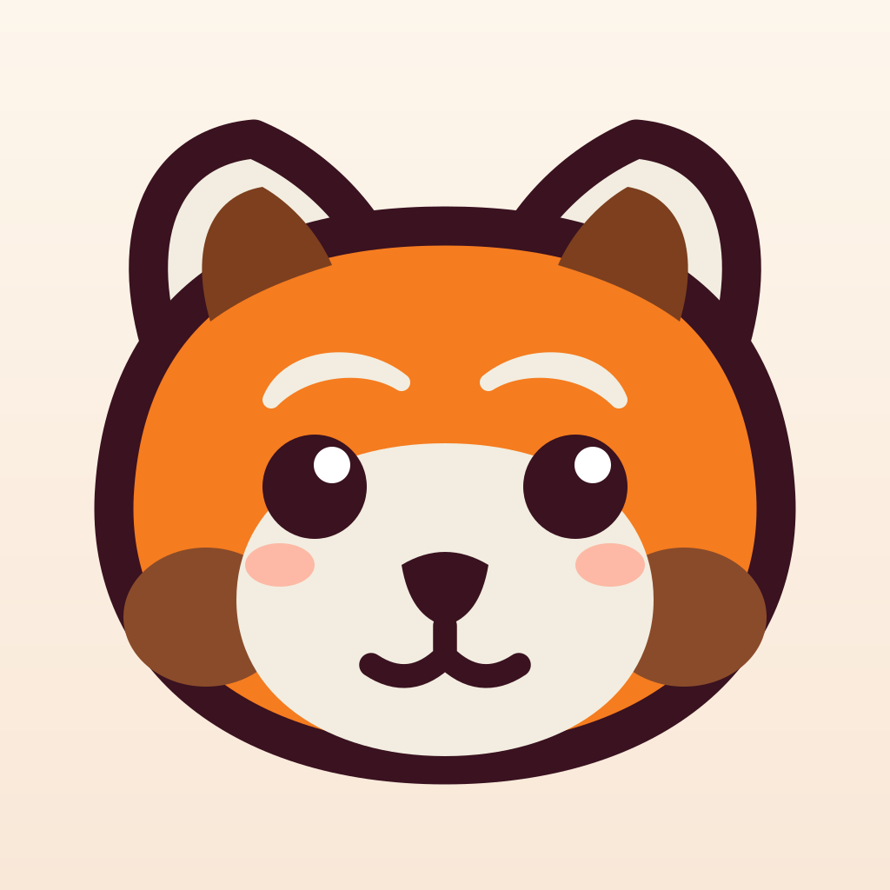
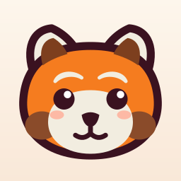
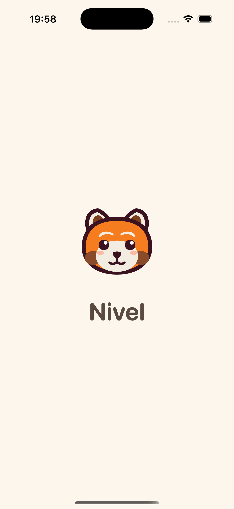

# Nivel

<p align="center">
  
</p>

**Nivel** est une app iOS de perte de poids **gamifiée et zéro pression** : on logge ses repas en quelques secondes, on suit ses pas et son poids, on valide de petites activités physiques (marche, étirements, gainage… et la « séance du jour », la même sur les deux téléphones), et on gagne de l'XP, des niveaux, des quêtes et des badges — sans jamais de rouge, de culpabilité ni d'échec. Un jour "raté" n'existe pas : Nivel encourage, il ne juge pas.

Cinq onglets : **Accueil · Repas · Sport · Progrès · Quêtes** — les Réglages sont accessibles via le bouton ⚙️ en haut de l'accueil.

Le tout est accompagné de **Nivelito**, un petit panda roux qui commente la journée avec bienveillance (et qui sert d'icône à l'app).

## Captures

|  |  |
|:---:|:---:|
| L'icône de l'app : Nivelito sur fond crème. | L'écran de démarrage, avec Nivelito qui t'accueille. |

*(davantage de captures après installation sur iPhone)*

## Architecture

- **`NivelCore/`** — package Swift **pur** (aucune dépendance UI ni SwiftData) : calculs de calories, XP, niveaux, quêtes, badges, tendance de poids, banque de messages. Entièrement testé avec `swift test`.
- **`App/`** — l'app **SwiftUI + SwiftData** : vues, services (HealthKit, notifications, clôture de journée, GameService), thème, Nivelito.
- Le projet Xcode est **généré par [XcodeGen](https://github.com/yonaskolb/XcodeGen)** à partir de `project.yml` : ne pas éditer le `.xcodeproj` à la main, relancer `xcodegen generate` après toute modification de `project.yml`.

## Commandes

```sh
# Générer le projet Xcode (après clone ou modification de project.yml)
xcodegen generate

# Tests de la logique pure (NivelCore)
cd NivelCore && swift test

# Tests de l'app (SwiftData, services) sur simulateur
xcodebuild -project Nivel.xcodeproj -scheme Nivel \
  -destination 'platform=iOS Simulator,name=iPhone 17 Pro' test
```

## Installer Nivel sur ton iPhone (compte Apple gratuit)

Pas besoin de compte développeur payant — mais l'app **expire au bout de 7 jours** (voir plus bas).

1. Générer et ouvrir le projet : `xcodegen generate && open Nivel.xcodeproj`.
2. Dans Xcode, sélectionner la target **Nivel** → onglet **Signing & Capabilities** → **Team** = ton Apple ID personnel.
   *Si aucun compte n'apparaît : Xcode → **Settings…** → **Accounts** → **+** → ajouter ton Apple ID.*
3. Brancher l'iPhone en USB (accepter "Se fier à cet ordinateur" sur le téléphone si demandé).
4. Sélectionner l'iPhone comme **destination** en haut de la fenêtre Xcode, puis **⌘R**.
5. **Premier lancement uniquement** : l'iPhone bloque l'app. Aller dans **Réglages → Général → VPN et gestion de l'appareil**, toucher ton profil développeur et **faire confiance**. Relancer l'app.

> ⚠️ **À refaire TOUS LES 7 JOURS** : avec un compte gratuit, la signature expire au bout d'une semaine — l'app refuse alors de se lancer. Il suffit de rebrancher **chaque téléphone** et de refaire ⌘R (étapes 3-4). Si c'est trop contraignant à l'usage, le compte développeur payant (99 €/an) supprime cette limite.

**Deux utilisateurs, deux téléphones** : chacun (Michaël / Marion) choisit **son profil à l'onboarding sur SON téléphone**. Les données restent locales à chaque appareil.

## Structure du projet

```
Nivel/
├── project.yml              # Définition XcodeGen (targets Nivel + NivelTests)
├── NivelCore/               # Package Swift : logique métier pure + tests unitaires
│   ├── Sources/NivelCore/   #   Calories, XP, niveaux, quêtes, badges, tendance poids,
│   │                        #   catalogues JSON (plats, extras, activités, séances…)
│   └── Tests/               #   `swift test`
├── App/                     # App SwiftUI + SwiftData
│   ├── Models/              #   Modèles persistés (profil, repas, pesées, journal…)
│   ├── Services/            #   GameService, HealthKit, notifications, clôture de journée
│   ├── Views/               #   Accueil, repas, sport, progrès, quêtes, réglages, onboarding…
│   ├── Nivelito/            #   La mascotte (formes vectorielles, bulles de dialogue)
│   └── Assets.xcassets/     #   Icône d'app, couleurs
├── NivelTests/              # Tests d'intégration de l'app (simulateur)
├── design/                  # SVG sources (Nivelito, icône d'app)
└── docs/                    # Spec et plan d'implémentation
```
